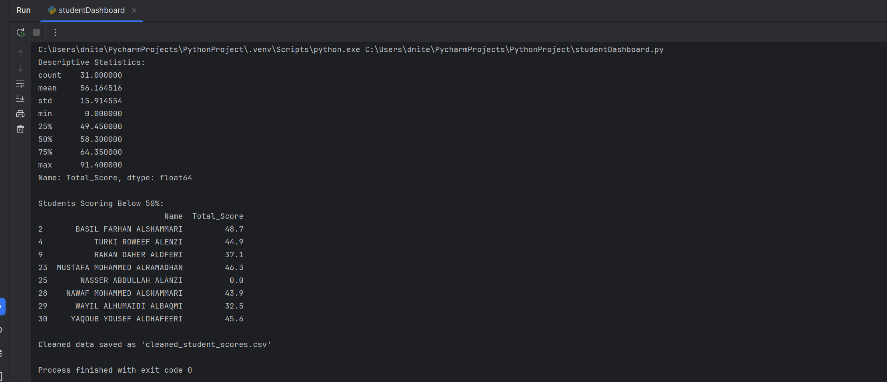
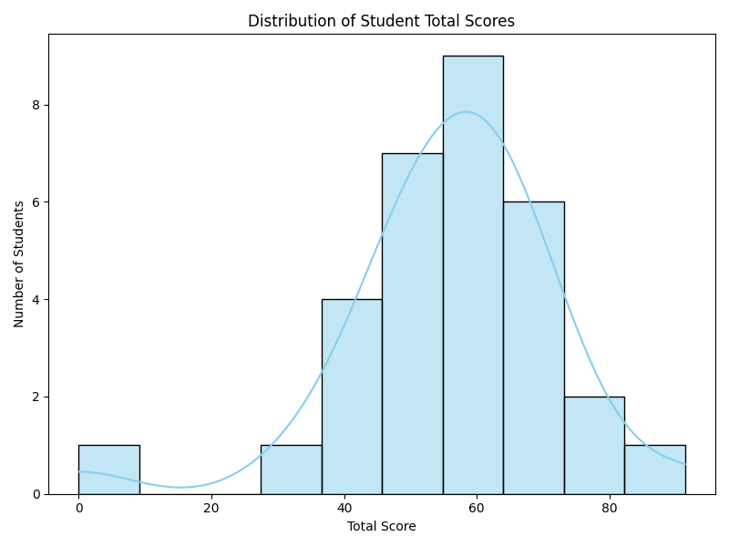

# Student Performance Dashboard

## 🎯 Objective
Build an interactive dashboard to analyze student performance using raw Excel data.

## 🛠 Tools Used
- Python
- Pandas
- OpenPyXL
- Plotly / Matplotlib

## 📁 Project Structure
```
student-performance-dashboard/
├── data/
│   └── MGS E05.xlsx
├── cleaned_student_scores.csv
├── studentDashboard.py
├── studentDashboard_Screenshot.png
├── StudentDashboard_fig1.png
└── README.md
```

## 📷 Screenshot




## ▶️ How to Run
1. Ensure required libraries are installed:
```bash
pip install pandas openpyxl matplotlib
```
2. Run the dashboard script:
```bash
python studentDashboard.py
```

## 📌 Notes
- Focused on Excel data handling, cleaning, and plotting.
